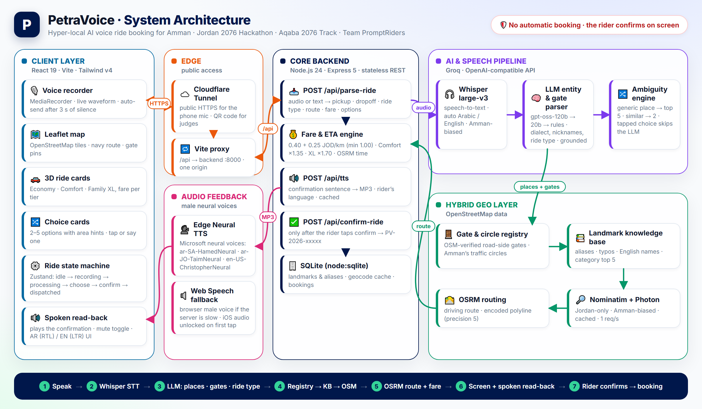
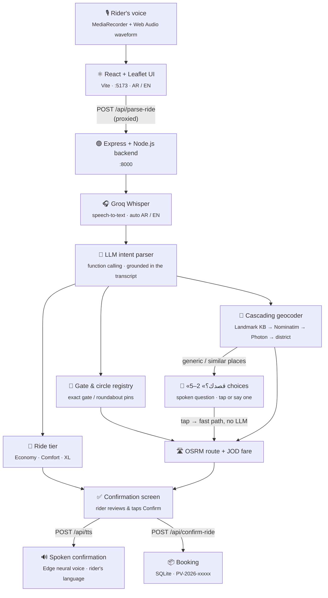

<div align="center">

# 🚗 PetraVoice

### Hyper-Local AI Voice Mobility Assistant

**«وصلني من دوار الواحة لمستشفى الاستقلال»**<br />
*Say it — and your ride is mapped, priced and read back to you, ready to confirm.*

<br />

**Jordan 2076 Hackathon** · **Aqaba 2076 Track** (Powered by Petra Ride)<br />
**Team PromptRiders** · **Sub-Track 02:** AI Voice Mobility Assistant

<br />


<br />


<br />


<br />

[Executive Summary](#-executive-summary) ·
[Features](#-key-features--technical-highlights) ·
[Architecture](#%EF%B8%8F-system-architecture) ·
[Tech Stack](#%EF%B8%8F-tech-stack) ·
[Getting Started](#-getting-started) ·
[Live Demo](#-live-demo--tunneling-for-evaluators--judges) ·
[Demo Videos](#-demo-videos-fully-automated)

</div>

<br />

## 📌 Executive Summary

**PetraVoice** is a resilient, hands-free voice booking assistant built for on-demand mobility in Jordan.
Riders simply **tap the mic and speak** — in colloquial Jordanian Arabic or English — and PetraVoice
transcribes the request, understands who goes where, finds both places on the map and fills in a complete
ride: route, distance, time, fare and ride tier — then **reads it back in a natural male voice, in the
rider's own language**: «أبشر، جهزتلك رحلة اقتصادية من مكة مول بوابة 2 إلى دوار صويلح…».

It handles the way people really talk in Amman: **inverted pickup / destination order**, nicknames
(«التكنو», «البوليفارد», «الكيلو»), speech-recognition slips («ورد جندي» → «دوار الجندي»), gates and
entrances («بوابة 2», «البوابة الشمالية») pinned at the **actual gate**, and spoken ride preferences
(«سيارة كبيرة للعيلة», "luggage", "VIP"). Vague requests («وصلني ع المستشفى») get a spoken **«أي مستشفى؟»**
with the five best-known options — one tap and the ride is ready.

> [!IMPORTANT]
> **Safety gate — no automatic booking, ever.** PetraVoice only *prepares* the ride. A trip is created
> only after the rider reviews the details on screen and taps **«تأكيد الرحلة» / Confirm ride**.

<br />

## ✨ Key Features & Technical Highlights

<table>
<tr>
<td width="50%" valign="top">

### 🗣️ Colloquial Jordanian NLU
Built for spoken Ammiya: filler words («يا غالي», «الله يخليك», "hey man"), inverted syntax
(«بدي اروح على الواحة وانا عند الاستقلال»), nicknames and speech-to-text typos
(«الأمير فاسل» → «الأمير فيصل»). Every extracted place is **checked against the rider's actual words**
to block LLM hallucinations.

</td>
<td width="50%" valign="top">

### 🎯 Gate-Aware Pins
Gates and entrances («بوابة 2», «البوابة التانية», "parking gate") are separated from the landmark, and for
big landmarks the **pin moves to the road-side gate** itself, not the roof of the building:
**«مكة مول • بوابة 2»**, City Mall parking entrance, University of Jordan main / north / agriculture /
engineering gates. Other gates still reach the driver as a note.

</td>
</tr>
<tr>
<td width="50%" valign="top">

### 🗺️ Cascading Spatial Geocoding
0. **Gate & traffic-circle registry** — exact OSM-verified points for gates and Amman's circles
   (1st–8th, صويلح, الواحة, المدينة الرياضية, «الكيلو» / دوار الحرمين), circle names never shortened
1. Local **landmark knowledge base** (SQLite) — malls, hospitals, universities, districts
2. **OpenStreetMap Nominatim** with LLM-generated search variants (Arabic + official English names)
3. Keyword stripping + city context · 4. **Photon** fuzzy search (Jordan-only)
5. Graceful fallback to the **district centre**, clearly marked «موقع تقريبي»

Areas the rider names («…بالشميساني») are enforced — no more branches in the wrong city.

</td>
<td width="50%" valign="top">

### ⚡ Voice-Driven Ride Tiers
The ride category is picked from what the rider says —
**Economy** («رخيصة», "cheapest"), **Comfort** («فخمة», "VIP"),
**Family XL** («سيارة كبيرة للعيلة», "luggage", "6 people") — and pre-selected on screen,
while the rider can still change it before confirming.

</td>
</tr>
<tr>
<td width="50%" valign="top">

### 🌍 Bilingual AR / EN
Automatic language detection for speech and text — speak Arabic, get Arabic back; speak English, get
English. Stray translations Whisper sometimes appends are dropped. English requests get English place
names (“University of Jordan • North Gate”); one tap switches the whole UI between Arabic (RTL) and
English (LTR).

</td>
<td width="50%" valign="top">

### 📱 Built for the Live Demo
Map-first mobile UI with a pull-down sheet, live waveform and 3-second silence auto-send.
**Cloudflare Quick Tunnels** give instant HTTPS (required for the phone microphone) and a
**terminal QR code** lets judges try it on their own phones in seconds.

</td>
</tr>
<tr>
<td width="50%" valign="top">

### 🔊 Spoken Confirmation
As soon as the route and fare appear, a calm male neural voice reads the ride back —
**Hamed** (Arabic) or **Christopher** (English), via Microsoft Edge neural TTS, no API key.
Falls back to the browser's own male voice if the server is slow; works on iPhone too
(audio unlocked on the first tap). One tap on 🔈 mutes it.

</td>
<td width="50%" valign="top">

### 🧪 End-to-End Tested
`npm run test:e2e` drives the real pipeline — LLM, gate registry, geocoder, OSRM and TTS — through
realistic Amman requests and checks every pin to the metre:
gate pickups, nickname circles, current-location rides and English requests, «قصدك؟» categories and
tapped choices, plus valid MP3 audio.

</td>
</tr>
<tr>
<td width="50%" valign="top">

### 🔀 Smart «قصدك؟» Choices
Say just a category — «وصلني ع المستشفى», «بدي أروح ع الجامعة», "take me to the mall" — and the app asks
**«أي مستشفى؟»** out loud and shows the **top 5** places of that kind as cards with their area
(universities, hospitals, malls, schools). Answered from a local registry: **no map search, no extra LLM
call**. Tap one (or say it) and the route and fare appear in **under half a second**.

</td>
<td width="50%" valign="top">

### 🎬 Automated Demo Videos
One command records the real app end to end — Jordanian voiceover, real spoken requests through the fake
microphone, Whisper and the LLM — and edits it with FFmpeg: a **1080p landscape** cut, or a
**1080×1920 vertical** cut with animated Arabic captions, camera zooms and scene fades at 60 fps.

</td>
</tr>
</table>

<br />

## 🏗️ System Architecture



<sub>Regenerate with <code>cd demo &amp;&amp; npm run diagram</code>.</sub>



<details>
<summary><b>Request flow in one sentence</b></summary>

<br />

Audio (or typed text) → **Whisper** transcript (only the spoken language kept) → known mishearings fixed →
**LLM** extracts language, pickup, dropoff, gates, ride tier and search candidates → each place is checked
against the transcript → **gate & circle registry**, then the **cascading geocoder**, resolve coordinates
(a generic category or two similar places → **«قصدك؟»** with 2–5 options; a tapped option comes back as
«إلى مستشفى الخالدي» and is answered from the registry without the LLM) → **OSRM** computes the route →
fare is priced per tier → the app shows everything, **reads it back aloud**, and waits for
**manual confirmation**.

</details>

<br />

## 🛠️ Tech Stack

| Layer | Technologies & Tools |
| :-- | :-- |
| **Frontend** | React 19 · TypeScript · Tailwind CSS v4 · Vite · Zustand · Framer Motion · Leaflet / OpenStreetMap · MediaRecorder + Web Audio API |
| **Backend** | Node.js 24 · Express 5 · TypeScript · SQLite (`node:sqlite`) · REST API |
| **AI / NLU** | Groq **whisper-large-v3** (speech-to-text) · Groq **gpt-oss-120b** with automatic fallback to **gpt-oss-20b** · rule-based parser as a last resort |
| **Voice Output** | Microsoft Edge neural TTS via `msedge-tts` (`ar-SA-HamedNeural`, `en-US-ChristopherNeural`) · optional OpenAI `tts-1` · Web Speech API fallback |
| **Geocoding & Routing** | Gate & traffic-circle registry · Generic-category registry (top-5 «قصدك؟») · Local landmark KB · OpenStreetMap **Nominatim** · **Photon** fuzzy search · **OSRM** routing (encoded polyline) |
| **Testing** | End-to-end pipeline test (`npm run test:e2e`, 7 rides + TTS) · TypeScript strict mode |
| **Demo Infrastructure** | **Cloudflare Quick Tunnels** (`cloudflared`) · QR code CLI (`qrcode-terminal`) · **Playwright** + **FFmpeg** automated demo videos |

<br />

## 🚀 Getting Started

### Prerequisites

- **Node.js 24+** (the backend uses Node's built-in SQLite and runs TypeScript directly)
- **npm**
- A free **Groq API key** — [console.groq.com](https://console.groq.com) (for speech-to-text and the LLM)
- **cloudflared** — only for the live mobile demo

### 1 · Backend

```bash
cd backend
npm install
cp .env.example .env        # then set GROQ_API_KEY=gsk_...
npm run dev
# → http://localhost:8000   (health check: /api/health)
```

### 2 · Frontend

```bash
cd frontend
npm install
npm run dev
# → http://localhost:5173
```

> [!TIP]
> No key yet? Typed requests still work through the built-in rule-based parser, and
> `VITE_USE_MOCK=true` in `frontend/.env.local` runs the whole UI without a backend.

### 3 · Voice settings (optional)

The spoken confirmation works out of the box — no key needed. To change it, set in `backend/.env`:

| Variable | Default | |
| :-- | :-- | :-- |
| `TTS_PROVIDER` | `edge` | `edge` (neural voices) · `openai` (uses `OPENAI_API_KEY`) · `none` (browser voice only) |
| `TTS_VOICE_AR` | `ar-SA-HamedNeural` | e.g. `ar-JO-TaimNeural` for a Jordanian accent |
| `TTS_VOICE_EN` | `en-US-ChristopherNeural` | e.g. `en-US-GuyNeural` |

### 4 · End-to-end test

With the backend running:

```bash
cd backend
npm run test:e2e
```

Runs realistic requests through the whole pipeline and checks every pin against the registry (within 30 m):

| # | Request | Checks |
| :-- | :-- | :-- |
| 1 | «بدي سيارة من مكة مول بوابة 2 لدوار صويلح» | pin on Mecca Mall Gate 2 · «دوار» kept · Sweileh Circle |
| 2 | «وصلني على الجامعة الأردنية البوابة الشمالية» | current-location pickup · UJ North Gate |
| 3 | «خذني على دوار الكيلو» | nickname → Kilo (Al-Haramain) Circle |
| 4 | "I need an economy ride from City Mall to Seventh Circle" | English names · economy · 7th Circle |
| 5 | «وصلني ع المستشفى» | «قصدك؟» with the 5 hospitals, in order, at their pins · no fare yet |
| 6 | "take me to the mall" | the 5 malls with English names |
| 7 | «إلى مستشفى الخالدي» (a tapped option) | fast path (no LLM) · full route and fare |
| + | `/api/tts` Arabic and English | 200 · valid MP3 audio |

Requests are spaced 15 s apart to stay inside Groq's free-tier rate limit.

<br />

## 📱 Live Demo & Tunneling (For Evaluators & Judges)

Phones only allow the microphone on **HTTPS** pages. A Cloudflare Quick Tunnel gives the local app a public
HTTPS address — no account, no warning page. The app calls the relative path `/api`, so every request from a
phone flows **tunnel → Vite proxy → backend**, never to `localhost`.

**One-time setup**

```bash
winget install --id Cloudflare.cloudflared      # Windows (macOS: brew install cloudflared)
cd demo && npm install
```

**On stage — one command** (with backend and frontend already running):

```bash
cd demo
npm run tunnel
```

It checks both servers, opens the tunnel and prints a **QR code** for the projector. Keep the window open —
closing it ends the tunnel. On Windows, `.\start-tunnel.ps1` from the project root does the same.

> [!NOTE]
> Every new tunnel gets a **new random URL**, so regenerate the QR code each time. The link is public:
> anyone who opens it uses your Groq quota. **iPhone:** turn off the silent switch to hear the spoken
> confirmation.

<details>
<summary><b>Manual alternative</b></summary>

<br />

```bash
cloudflared tunnel --url http://localhost:5173
# copy the https://<name>.trycloudflare.com URL, then:
cd demo
npm run qr -- https://<name>.trycloudflare.com
```

</details>

📷 **Scan the QR code with any smartphone camera** to launch the live assistant.

<br />

## 🎬 Demo Videos (Fully Automated)

With the backend and frontend running, one command produces a finished, narrated video of the real app —
no screen recorder, no editing:

```bash
cd demo
npm run record              # → backend/demo_video_final.mp4           (landscape, 1920×1080)
npm run record:vertical     # → backend/demo_video_vertical_final.mp4  (vertical 9:16, 1080×1920)
```

**What happens**

1. **Voiceover** — colloquial Jordanian lines spoken by `ar-JO-TaimNeural` (Edge neural TTS).
2. **Three real voice bookings** — each request is played into Chromium's fake microphone, so the app hears
   it through the real pipeline (mic → Whisper → LLM → registry → OSRM):
   - «يعطيك العافية، بدي سيارة من مكة مول بوابة 2 لدوار صويلح» → pin on **Gate 2** → Sweileh Circle
   - «بدنا سيارة عائلية من الدوار السابع للمطار، واحنا خمس أشخاص» → **Family XL** picked from speech
   - «وصلني على الجامعة لو سمحت» → **«أي جامعة؟»** with five choices → الجامعة الأردنية
3. **Spoken replies** use the **real fare of each run**, said the Jordanian way («دينارين ونص», «ستطعش دينار»).
4. **Editing (FFmpeg)** — the silence and server waits are cut (~1 minute total); the vertical cut adds
   Chromium-rendered Arabic captions (Tajawal, Petra navy pills), camera zooms onto the mic, the gate pin and
   the XL card, soft scene dips and fades, exported at 60 fps.

> [!NOTE]
> Frames are full-resolution screenshots (headless Chromium can't record sharp *and* fast), so the app's own
> animations update ~10×/s; camera moves, captions and fades are rendered at the full 60 fps. If Whisper ever
> mishears a request, that take falls back to typing it, so a video is always produced. ~3–5 minutes and
> 4 Groq requests per run. Edit the rides, lines and captions in the `RIDES` list at the top of
> `demo/record-demo.mjs` / `demo/record-vertical.mjs`.

<br />

## 🗂️ Project Structure

```
PetraVoice/
├── frontend/     React + Vite mobile UI          →  frontend/README.md
├── backend/      Express API, NLU & geocoding    →  backend/README.md
├── demo/         Tunnel + QR code, demo-video recorders  →  demo/README.md
└── CLAUDE.md     Shared API contract (single source of truth)
```

Key places to extend:

| What | Where |
| :-- | :-- |
| Gates and traffic circles | `backend/src/data/geoKnowledge.ts` |
| «قصدك؟» category lists (top 5 per category) | `GENERIC_CATEGORIES` in `backend/src/data/landmarks.ts` |
| Other landmarks and aliases | `backend/src/data/landmarks.ts` |
| Spoken sentences (confirmation, «أي مستشفى؟») | `frontend/src/lib/speech.ts` |
| Area hints under the choice cards | `PLACE_AREAS` in `frontend/src/lib/i18n.ts` |
| Demo-video rides, voiceover and captions | `demo/record-demo.mjs`, `demo/record-vertical.mjs` |

<sub>Ride-card car images are based on [Microsoft Fluent Emoji 3D](https://github.com/microsoft/fluentui-emoji)
(MIT) — see `frontend/public/cars/LICENSE.txt`.</sub>

<br />

<div align="center">

## 👥 Team PromptRiders

Developed for the **Jordan 2076 Hackathon** — **Aqaba 2076 Track**, powered by **Petra Ride**.

<sub>صُنع في الأردن 🇯🇴 · Made in Jordan</sub>

</div>
