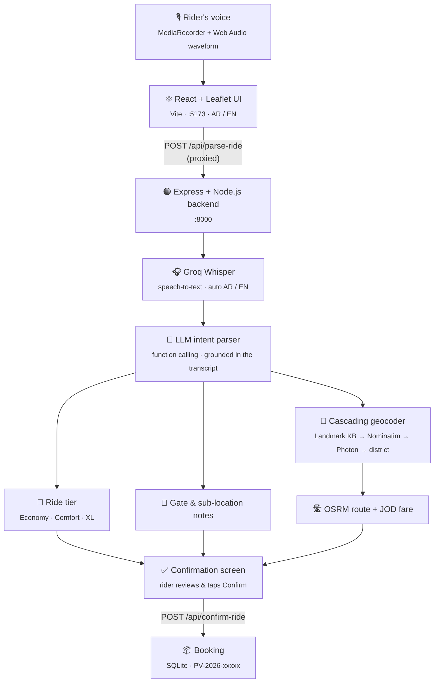

<div align="center">

# 🚗 PetraVoice

### Hyper-Local AI Voice Mobility Assistant

**«وصلني من دوار الواحة لمستشفى الاستقلال» — and your ride is ready to confirm.**

<br />

**Jordan 2076 Hackathon** · **Aqaba 2076 Track** (Powered by Petra Ride)<br />
**Team PromptRiders** · **Sub-Track 02:** AI Voice Mobility Assistant

<br />


<br />


<br />

[Executive Summary](#-executive-summary) ·
[Features](#-key-features--technical-highlights) ·
[Architecture](#%EF%B8%8F-system-architecture) ·
[Tech Stack](#%EF%B8%8F-tech-stack) ·
[Getting Started](#-getting-started) ·
[Live Demo](#-live-demo--tunneling-for-evaluators--judges)

</div>

<br />

## 📌 Executive Summary

**PetraVoice** is a resilient, hands-free voice booking assistant built for on-demand mobility in Jordan.
Riders simply **tap the mic and speak** — in colloquial Jordanian Arabic or English — and PetraVoice
transcribes the request, understands who goes where, finds both places on the map and fills in a complete
ride: route, distance, time, fare and ride tier.

It handles the way people really talk in Amman: **inverted pickup / destination order**, nicknames
(«التكنو», «البوليفارد», «السابع»), speech-recognition slips («ورد جندي» → «دوار الجندي»), gates and
entrances («بوابة 2», «جهة الطوارئ»), and spoken ride preferences («سيارة كبيرة للعيلة», "luggage", "VIP").

> [!IMPORTANT]
> **Safety gate — no automatic booking, ever.** PetraVoice only *prepares* the ride. A trip is created
> only after the rider reviews the details on screen and taps **«تأكيد الرحلة» / Confirm ride**.

<br />

## ✨ Key Features & Technical Highlights

<table>
<tr>
<td width="50%" valign="top">

### 🗣️ Colloquial Jordanian NLU
Built for spoken Ammiya: filler words («يا غالي», «الله يخليك», "hey man"), inverted syntax
(«بدي اروح على الواحة وانا عند الاستقلال»), nicknames and speech-to-text typos
(«الأمير فاسل» → «الأمير فيصل»). Every extracted place is **checked against the rider's actual words**
to block LLM hallucinations.

</td>
<td width="50%" valign="top">

### 🎯 Gate & Sub-Direction Isolation
Gates, entrances and sides («بوابة 2», «المدخل الرئيسي», "Terminal 1") are separated from the landmark,
so only the clean name goes to the geocoder — then shown to the rider and passed on for the driver:
**«مكة مول • بوابة 2»**.

</td>
</tr>
<tr>
<td width="50%" valign="top">

### 🗺️ Cascading Spatial Geocoding
1. Local **landmark knowledge base** (SQLite) — Amman circles, malls, hospitals, universities, districts
2. **OpenStreetMap Nominatim** with LLM-generated search variants (Arabic + official English names)
3. Keyword stripping + city context · 4. **Photon** fuzzy search (Jordan-only)
5. Graceful fallback to the **district centre**, clearly marked «موقع تقريبي»

Areas the rider names («…بالشميساني») are enforced — no more branches in the wrong city.

</td>
<td width="50%" valign="top">

### ⚡ Voice-Driven Ride Tiers
The ride category is picked from what the rider says —
**Economy** («رخيصة», "cheapest"), **Comfort** («فخمة», "VIP"),
**Family XL** («سيارة كبيرة للعيلة», "luggage", "6 people") — and pre-selected on screen,
while the rider can still change it before confirming.

</td>
</tr>
<tr>
<td width="50%" valign="top">

### 🌍 Bilingual AR / EN
Automatic language detection for speech and text. English requests get English place names
(«Queen Alia International Airport • Gate 2»); one tap switches the whole UI between Arabic (RTL)
and English (LTR).

</td>
<td width="50%" valign="top">

### 📱 Built for the Live Demo
Map-first mobile UI with a pull-down sheet, live waveform and 3-second silence auto-send.
**Cloudflare Quick Tunnels** give instant HTTPS (required for the phone microphone) and a
**terminal QR code** lets judges try it on their own phones in seconds.

</td>
</tr>
</table>

<br />

## 🏗️ System Architecture



<details>
<summary><b>Request flow in one sentence</b></summary>

<br />

Audio (or typed text) → **Whisper** transcript → known mishearings fixed → **LLM** extracts language,
pickup, dropoff, gate notes, ride tier and search candidates → each place is checked against the transcript
→ **cascading geocoder** resolves coordinates → **OSRM** computes the route → fare is priced per tier →
the app shows everything for **manual confirmation**.

</details>

<br />

## 🛠️ Tech Stack

| Layer | Technologies & Tools |
| :-- | :-- |
| **Frontend** | React 19 · TypeScript · Tailwind CSS v4 · Vite · Zustand · Framer Motion · Leaflet / OpenStreetMap · MediaRecorder + Web Audio API |
| **Backend** | Node.js 24 · Express 5 · TypeScript · SQLite (`node:sqlite`) · REST API |
| **AI / NLU** | Groq **whisper-large-v3** (speech-to-text) · Groq **gpt-oss-120b** with automatic fallback to **gpt-oss-20b** · rule-based parser as a last resort |
| **Geocoding & Routing** | Local landmark KB · OpenStreetMap **Nominatim** · **Photon** fuzzy search · **OSRM** routing (encoded polyline) |
| **Demo Infrastructure** | **Cloudflare Quick Tunnels** (`cloudflared`) · QR code CLI (`qrcode-terminal`) |

<br />

## 🚀 Getting Started

### Prerequisites

- **Node.js 24+** (the backend uses Node's built-in SQLite and runs TypeScript directly)
- **npm**
- A free **Groq API key** — [console.groq.com](https://console.groq.com) (for speech-to-text and the LLM)
- **cloudflared** — only for the live mobile demo

### 1 · Backend

```bash
cd backend
npm install
cp .env.example .env        # then set GROQ_API_KEY=gsk_...
npm run dev
# → http://localhost:8000   (health check: /api/health)
```

### 2 · Frontend

```bash
cd frontend
npm install
npm run dev
# → http://localhost:5173
```

> [!TIP]
> No key yet? Typed requests still work through the built-in rule-based parser, and
> `VITE_USE_MOCK=true` in `frontend/.env.local` runs the whole UI without a backend.

<br />

## 📱 Live Demo & Tunneling (For Evaluators & Judges)

Phones only allow the microphone on **HTTPS** pages. A Cloudflare Quick Tunnel gives the local app a public
HTTPS address — no account, no warning page. The app calls the relative path `/api`, so every request from a
phone flows **tunnel → Vite proxy → backend**, never to `localhost`.

**One-time setup**

```bash
winget install --id Cloudflare.cloudflared      # Windows (macOS: brew install cloudflared)
cd demo && npm install
```

**On stage — one command** (with backend and frontend already running):

```bash
cd demo
npm run tunnel
```

It checks both servers, opens the tunnel and prints a **QR code** for the projector. Keep the window open —
closing it ends the tunnel.

<details>
<summary><b>Manual alternative</b></summary>

<br />

```bash
cloudflared tunnel --url http://localhost:5173
# copy the https://<name>.trycloudflare.com URL, then:
cd demo
npm run qr -- https://<name>.trycloudflare.com
```

</details>

📷 **Scan the QR code with any smartphone camera** to launch the live assistant.

<br />

## 🗂️ Project Structure

```
PetraVoice/
├── frontend/     React + Vite mobile UI          →  frontend/README.md
├── backend/      Express API, NLU & geocoding    →  backend/README.md
├── demo/         Cloudflare tunnel + QR code      →  demo/README.md
└── CLAUDE.md     Shared API contract (single source of truth)
```

<br />

<div align="center">

## 👥 Team PromptRiders

Developed for the **Jordan 2076 Hackathon** — **Aqaba 2076 Track**, powered by **Petra Ride**.

<sub>صُنع في الأردن 🇯🇴 · Made in Jordan</sub>

</div>
